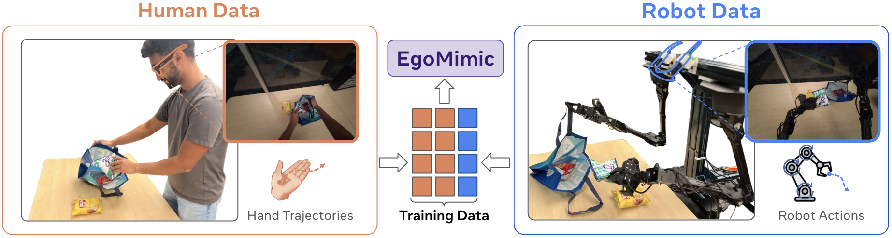

# EgoMimic: Scaling Imitation Learning through Egocentric Video


This repository contains the data processing and training code for EgoMimic - Both for Human Aria and Robot teleoperated Data. To rollout policies in the real world, you'll additionally need our hardware repo [Eve](https://github.com/SimarKareer/Eve).

**Useful Links**
- [Project Website](https://egomimic.github.io/)
- [Sample Dataset Huggingface](https://huggingface.co/datasets/gatech/EgoMimic/tree/main)

---

## Structure
- [``egomimic/scripts/aloha_process``](./egomimic/scripts/aloha_process/): Process raw aloha style data into a robomimic style hdf5, compatible for training here.
- [``egomimic/scripts/aria_process``](./egomimic/scripts/aria_process/): Process human embodiment data from Aria Glasses into a robomimic style hdf5.
- [``egomimic/algo``](./egomimic/algo): Algorithm code for Egomimic, as well as ACT and mimicplay baselines
- [``egomimic/configs``](./egomimic/configs): Train configs for each algorithm
- [``egomimic/scripts/pl_train.py``](./egomimic/scripts/pl_train.py): Main training script, powered by Pytorch Lightning (DDP enabled)
- [``data_processing.md``](./data_processing.md): Instructions to process your own data, both Aria Human data and teleoperated robot data.

## Installation

```
git clone --recursive git@github.com:SimarKareer/EgoMimic.git
cd EgoMimic
conda env create -f environment.yaml
pip install projectaria-tools'[all]'
pip install -e external/robomimic
pip install -e .
python external/robomimic/robomimic/scripts/setup_macros.py
```

Set `git config --global submodule.recurse true` if you want `git pull` to automatically update the submodule as well.

Then go to  `external/robomimic/robomimic/macros_private.py` and manually add your wandb username. Make sure you have ran `wandb login` too.


**Download Sample Data**
```
mkdir datasets
cd datasets

## Groceries
wget https://huggingface.co/datasets/gatech/EgoMimic/resolve/main/groceries_human.hdf5
wget https://huggingface.co/datasets/gatech/EgoMimic/resolve/main/groceries_robot.hdf5

## Laundry
wget https://huggingface.co/datasets/gatech/EgoMimic/resolve/main/smallclothfold_human.hdf5
wget https://huggingface.co/datasets/gatech/EgoMimic/resolve/main/smallclothfold_robot.hdf5


## Bowlplace
wget https://huggingface.co/datasets/gatech/EgoMimic/resolve/main/bowlplace_human.hdf5
wget https://huggingface.co/datasets/gatech/EgoMimic/resolve/main/bowlplace_robot.hdf5
```


-------


## EgoMimic Quick Start (Train on Sample Data)

EgoMimic Training (Toy in Bowl Task)
```
python scripts/pl_train.py --config configs/egomimic_oboo.json --dataset /path/to/bowlplace_robot.hdf5 --dataset_2 /path/to/bowlplace_human.hdf5 --debug
```

ACT Baseline Training
```
python scripts/pl_train.py --config configs/act.json --dataset /path/to/bowlplace_robot.hdf5 --debug
```

For a detailed list of commands to run each experiment see [experiment_launch.md](./experiment_launch.md)

Use `--debug` to check that the pipeline works

Launching runs via submitit / slurm
```
python scripts/pl_submit.py --config <config> --name <name> --description <description> --gpus-per-node <gpus-per-node>`
```

Training creates a folder for each experiment
```
./trained_models_highlevel/description/name
├── videos (generated offline validation videos)
├── logs (wandb logs)
├── slurm (slurm logs if launched via slurm)
├── config.json (copy of config used to launch this run)
├── models (model ckpts)
├── ds1_norm_stats.pkl (robot dataset normalization stats)
└── ds2_norm_stats.pkl (hand data norm stats if training egomimic)
```

Offline Eval:
`python scripts/pl_train.py --dataset <dataset> --ckpt_path <ckpt> --eval`

### Processing your own data for training

See [``data_processing.md``](./data_processing.md)

### Rollout policies in the real world
Follow these instructions on the desktop connected to the real hardware.
1. Follow instructions in [Eve](https://github.com/SimarKareer/Eve)
2. Install the hardware package into the `emimic` conda env via
```
conda activate emimic
cd ~/interbotix_ws/src/eve
pip install -e .
```
3. Rollout policy
```
cd EgoMimic/egomimic
python scripts/evaluation/eval_real --eval-path <path to>EgoPlay/trained_models_highlevel/<your model folder>/models/<your ckpt>.ckpt
```
